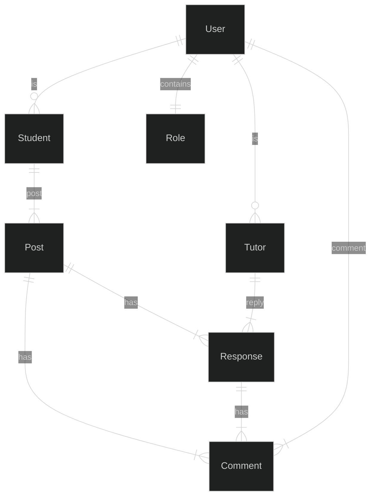
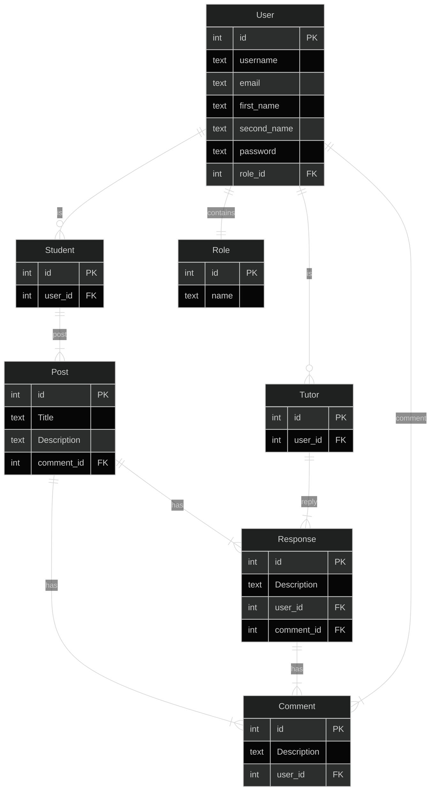

# Overview

This repositry contains an application to manage school and high school tutorships 

## Problem Definition

It is quite common for school kids to have problems doing their homework, or many times they have no idea how to do it, which is why it would be a good idea to have a place where students can post their problems and tutors the solutions to them.

## Priorties

### Must have

- A student must be able to log in and register
- A tutor must be able to log in and register
- A student must be able to post their doubs or questions
- A tutor must be able to respond student doubs or questions

### Should have

- A post should be able to qualify by tutors and students
- A response should be able to qualify by tutors and students
- There should be a comments part in every post
- There should be a comments part in every response

### Could have

- Tutors could offer private tutoring
- Students could request private tutoring

### Will not have

- Payment platforms integration

## Domain Model Diagram




## Entity Relationship Diagram




## API Specification

### Students

GET /students - Return all students

Response

```json
[
  {
    "user_id": 1,
    "first_name": "Ken",
    "last_name": "Jones",
  },
  {
    "user_id": 2,
    "first_name": "Mary",
    "last_name": "Jane",
  }
]
```

POST /students - Create a new student

Request

```json
[
  {
    "first_name": "new_f_name",
    "last_name": "new_l_name",
    "password": "new_password"
  }
]
```

PUT /students/{student_id} - Update an student using a given id

Request

```json
[
  {
    "first_name": "update_f_name",
    "last_name": "update_l_name",
    "password": "update_password"
  }
]
```

GET /students/{student_id} - Return the user for the given id

Response

```json
[
  {
    "user_id": 1,
    "first_name": "Ken",
    "last_name": "Jones",
  }
]
```

GET /students/{student_id}/posts - Return all post for the given student

Response

```json
[
  {
    "post_id" : 1
    "title": "how can I sum two square roots",
    "description": "Simplify the expression: √(5) + √(8)

                    Instructions:

                    Start by simplifying each square root individually.
                    Then, add the simplified square roots together to find the final result.
                    Express your answer in simplest radical form.",
  }
]
```
### Tutors

GET /tutors - Return all tutors

Response

```json
[
  {
    "user_id": 1,
    "first_name": "Ken",
    "last_name": "Jones",
  },
  {
    "user_id": 2,
    "first_name": "Mary",
    "last_name": "Jane",
  }
]
```

POST /tutors - Create a new tutor

Request

```json
[
  {
    "first_name": "new_f_name",
    "last_name": "new_l_name",
    "password": "new_password"
  }
]
```

PUT /tutors/{tutor_id} - Update a tutor using a given id

Request

```json
[
  {
    "first_name": "update_f_name",
    "last_name": "update_l_name",
    "password": "update_password"
  }
]
```

GET /tutors/{tutor_id} - Return the user for the given id

Response

```json
[
  {
    "user_id": 1,
    "first_name": "Ken",
    "last_name": "Jones",
  }
]
```

### Post

GET /posts - Return all posts

Response

```json
[
  {
    "post_id" : 1
    "title": "how can I sum two square roots",
    "description": "Simplify the expression: √(5) + √(8)

                    Instructions:

                    Start by simplifying each square root individually.
                    Then, add the simplified square roots together to find the final result.
                    Express your answer in simplest radical form.",
  },
  {
    "post_id" : 2
    "title": "Logic problem",
    "description": "Tommy has 8 apples, and he wants to share them equally among his 4 friends. How many apples will each friend receive?",
  }
]
```

POST /posts - Create a new post

Request

```json
  {
   "title": "Logic problem",
    "description": "Tommy has 8 apples, and he wants to share them equally among his 4 friends. How many apples will each friend receive?",
  }
```

PUT /post/{post_id} - Update a post using a given id

Request

```json
  {
   "title": "Logic problem",
    "description": "Tommy has 8 apples, and he wants to share them equally among his 4 friends. How many apples will each friend receive?",
  }
```

GET /post/{post_id} - Return the user for the given id

Response

```json
  {
   "title": "Logic problem",
    "description": "Tommy has 8 apples, and he wants to share them equally among his 4 friends. How many apples will each friend receive?",
  }
```

GET /post/{post_id}/responses - Return all the responses for the given id

Response

```json
[
  {
    "description": "this is a response for your problem",
  }, 
  {
    "description": "this is a different response for your problem",
  }, 
]
```

### Response

POST /response - Create a new response

Request

```json
  {
    "post_id": 1,
    "description": "this is a response for your problem",
  }
```

PUT /response/{response_id} - Update a response using a given id

Request

```json
  {
    "description": "Write down the number of apples Tommy has.",
  }
```

GET /response/{response_id} - Return the response for the given id

Response

```json
  {
    "description": "Write down the number of apples Tommy has.",
  }
```
